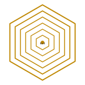

<p align="center">
  
</p>

<h1 align="center">🏛 hexa-scale</h1>

<p align="center"><strong>Multi-scale Architecture</strong> — design · build · operate · policy, from multiverse to city</p>

<p align="center">
  <a href="LICENSE"></a>
  
  
  
  <a href="https://github.com/dancinlab/echoes/blob/main/LATTICE_POLICY.md"></a>
  
</p>

<p align="center">multiverse · universe · galaxy · planet · country · city  ×  design · build · operate · policy</p>

---

`hexa-scale` is the **multi-scale architecture** standalone in the dancinlab HEXA-* family. One lattice spans six magnitudes of habitable scale — multiverse → universe → galaxy → planet → country → city — crossed with four lifecycle phases — design → build → operate → policy. The result is a 6 × 4 = 24-cell matrix, numerically matching the central n=6 identity `σ(n)·φ(n) = n·τ(n) = 24` (and the Jordan totient `J₂(6) = 24`) at n=6.

```
    ↕ phase \ scale →   multiverse   universe   galaxy   planet   country   city
    1. design               .           .         .        .         .        .
    2. build                .           .         .        .         .        .
    3. operate              .           .         .        .         .        .
    4. policy               .           .         .        .         .        .
                                                                          → 24 cells = J₂
```

> [!NOTE]
> Sibling of [`hexa-fusion`](https://github.com/dancinlab/hexa-fusion) · [`hexa-chip`](https://github.com/dancinlab/hexa-chip) · [`hexa-mind`](https://github.com/dancinlab/hexa-mind) · the other per-domain HEXA-* standalones extracted from [`dancinlab/echoes`](https://github.com/dancinlab/echoes). Where the other standalones drill one domain deep, `hexa-scale` runs the orthogonal axis — *scope* of habitable place, from cosmological down to civic.

> [!IMPORTANT]
> **Honest caveat** (raw#10 C3) — the n=6 lattice is an **organizing tool**, not a substitute for real math / physics / engineering / political-economy limits. Multiverse-scale, universe-scale, and galaxy-scale rows are **speculative** (no manufactured artifact at those scales exists or is forecast). Planet / country / city rows are **operational** (real artifacts exist; the lattice is one lens among many). Per [`echoes/LATTICE_POLICY.md`](https://github.com/dancinlab/echoes/blob/main/LATTICE_POLICY.md), n=6 lattice-fit is **forbidden** on external entities — NASA / SpaceX / ESA / KASI / IPCC / IEEE / ASTM / ISO / national building codes / city plans / treaty bodies all use their own published invariants, and this repo never claims those institutions adopt the lattice.

## At a glance

| Phase ↓ \ Scale → | Multiverse | Universe | Galaxy | Planet | Country | City |
|---|---|---|---|---|---|---|
| **Design** | parameter selection (Λ · α · masses) | type-Ia inflation regime | spiral arm geometry | atmosphere / hydrosphere targets | territorial bounds + capital siting | grid topology + zoning |
| **Build** | ⚠ speculative | ⚠ speculative | stellar engineering (Dyson-class) | terraforming (Mars / Venus class) | infrastructure rollout (power · water · road · rail · comm) | construction · permitting · trades |
| **Operate** | ⚠ speculative | ⚠ speculative | civilization-level monitoring | climate stabilisation · biosphere mgmt | governance · taxation · defence · diplomacy | utilities · transit · public safety · sanitation |
| **Policy** | ⚠ speculative | ⚠ speculative | first-contact protocols · panspermia treaty | planetary boundaries · climate treaties · biosphere law | constitutions · treaties · trade · IP · immigration · monetary policy | building codes · zoning · noise · land use · taxation |

⚠ = currently speculative — no manufactured artifact exists at this scale; cells are research-hypothesis placeholders, not engineering blueprints. See `SCALE.md` for the full 24-cell breakdown.

## Status

- **2026-05-14** — repo bootstrap. Lattice scaffold + 24-cell matrix sketched in [`SCALE.md`](SCALE.md). No code yet — this standalone is design SSOT first, implementations follow.
- **Reach goals (in order):**
  1. Fill the 12 operational cells (planet · country · city × design · build · operate · policy) with real-world references (architects · planners · treaty texts · code books)
  2. Tighten the 4 speculative-row cells (multiverse · universe · galaxy × any phase) with `⚠` honest-caveat tagging and explicit references to mainstream cosmology / astronomy invariants
  3. Galactic-scale operate / policy cells last — they cross both the lattice-policy "external entity" rule (galaxies don't belong to dancinlab) and the "no manufactured artifact" speculative-row rule

## 6-scale ladder

| Order | Scale | Tag | Representative invariants used by mainstream science (not n=6) |
|---|---|---|---|
| 1 | **Multiverse** | speculative | Tegmark Level I–IV · Λ-multiplicity (string landscape · 10⁵⁰⁰ vacua) |
| 2 | **Universe** | speculative | Λ-CDM · Hubble H₀ · Ωₘ · Ωₐ · Planck mass · spectral index nₛ |
| 3 | **Galaxy** | speculative | Hubble morphology · Tully-Fisher · stellar mass function · IMF |
| 4 | **Planet** | operational | Bond albedo · Stefan-Boltzmann · gravitational binding · plate tectonics |
| 5 | **Country** | operational | GDP · Gini · trade balance · constitutional separation-of-powers · UN charter |
| 6 | **City** | operational | population density · zoning codes · IBC / IRC / NEC / NFPA / ISO 37120 |

## 4 lifecycle phases

| Order | Phase | What | Receiving artifact |
|---|---|---|---|
| 1 | **Design** | parameter selection + topology + invariant framing | drawing · spec · diagram · simulation |
| 2 | **Build** | physical realisation · construction · deployment | artifact (building · structure · system) |
| 3 | **Operate** | runtime · maintenance · adjustment · users | live system serving stakeholders |
| 4 | **Policy** | rules · norms · enforcement · accountability | written code · treaty · constitution · regulation |

## Repo layout

```
hexa-scale/
├── README.md                ← this file (18-block format)
├── AGENTS.tape              ← sole agent-harness + governance + identity (.tape v1.2)
├── CLAUDE.md  → AGENTS.tape ← symlink (Claude Code auto-discovery)
├── SCALE.md                 ← 24-cell matrix domain ledger (the SSOT)
├── SEED.tape                ← runtime handoff (open decisions · anomalies · planned · log)
├── LICENSE                  ← MIT
└── docs/
    └── logo.svg             ← 6 nested flat-top hexagons (multiverse → city)
```

> [!NOTE]
> Project governance / AI-agent harness lives in [`AGENTS.tape`](AGENTS.tape) (`.tape` v1.2 grammar — §1 `@V` spec · §2 `@I` identity · §3 `@L` layout · §4 `@D g1..g9` governance · §5 `@F f1..f2` forbidden · §6 `@X x1..x5` citations · §7 `@N` notes · §8 `@H` generator hooks), not in a separate `AGENTS.md`. The file's top ~35 lines are a self-describing grammar primer comment block, so any LLM cold-reading it (via `CLAUDE.md` symlink discovery) can parse the rest. Runtime handoff (decisions in flight · anomalies · planned actions) lives in [`SEED.tape`](SEED.tape), separated by purpose. Trade-off documented in `AGENTS.tape::g9`: agents.md ecosystem tooling that doesn't speak `.tape` yet can fall back to a generated `AGENTS.md` via `@H h1` (`tape_to_agents_md`).

## License

[MIT](LICENSE) — Copyright © 2026 dancinlab. Use, modify, sublicense, sell freely; include the notice; no warranty.

## Cross-references

- 🪞 [dancinlab/echoes](https://github.com/dancinlab/echoes) — Discoveries catalog. `hexa-scale` is the 18th domain family, complementing the 17 existing per-domain HEXA-* standalones.
- 📐 [echoes/LATTICE_POLICY.md](https://github.com/dancinlab/echoes/blob/main/LATTICE_POLICY.md) — n=6 lattice policy SSOT; constrains how external entities (NASA / IPCC / national building codes / treaty bodies) are referenced.
- 🏛 [echoes/LIMIT_BREAKTHROUGH.md](https://github.com/dancinlab/echoes/blob/main/LIMIT_BREAKTHROUGH.md) — per-domain HARD_WALL / SOFT_WALL / BREAKABLE_WITH_TECH / UNCLEAR classifications.

---

<sub>🏛 hexa-scale · 6 scales × 4 phases = 24 = J₂ · multiverse → city · dancinlab HEXA-* family · 2026-05-14</sub>
